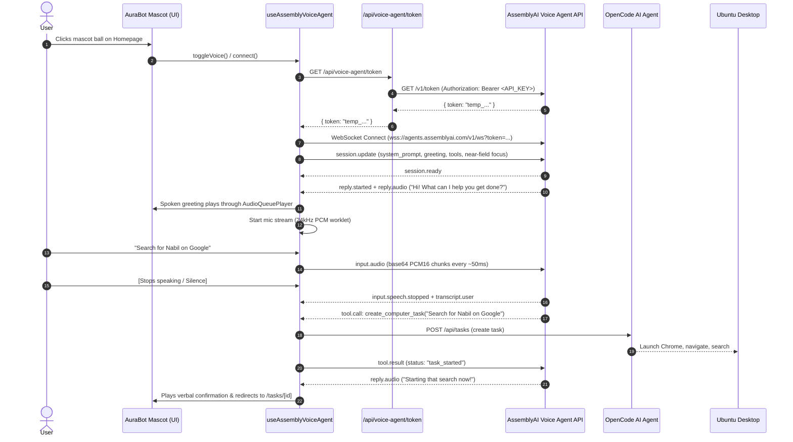

# AssemblyAI Voice-First Integration Architecture

This document provides a comprehensive technical breakdown of how **AssemblyAI's Voice Agent API** (`wss://agents.assemblyai.com/v1/ws`) is integrated into ByteBot to create a voice-first computer-use desktop assistant.

---

## 1. Architecture Overview

The integration transforms ByteBot from a traditional chat/form-based web UI into a full-duplex, voice-driven AI companion that controls an automated Ubuntu desktop through OpenCode.

```mermaid
graph TD
    User([User Voice]) -->|Microphone Audio| AudioWorklet[Inlined AudioWorklet]
    AudioWorklet -->|24kHz 16-bit Mono PCM ~50ms| BrowserHook[useAssemblyVoiceAgent Hook]
    
    subgraph Frontend Client [Next.js Web Client (bytebot-ui)]
        BrowserHook
        AudioPlayer[AudioQueuePlayer]
        AuraMascot[AuraBot Mascot & Bubble]
        SSEBridge[useMascotSpeech SSE Bridge]
    end

    subgraph Backend Auth [Next.js API Route]
        TokenRoute["/api/voice-agent/token"]
    end

    subgraph AssemblyAI Cloud [AssemblyAI Voice Agent API]
        VoiceAgentWS["wss://agents.assemblyai.com/v1/ws"]
        NeuralVAD[Neural Turn Detection & VAD]
        LLM[LLM & Tool Calling Engine]
        TTS[Voice Engine (Anna)]
    end

    subgraph Desktop Execution [ByteBot Agent & OpenCode]
        OpenCodeServer[OpenCode Agent :4096]
        ByteBotDesktop[Ubuntu Desktop & Chrome :9990]
    end

    BrowserHook -->|1. Fetch Token| TokenRoute
    TokenRoute -->|GET /v1/token Bearer API_KEY| AssemblyAICloud
    BrowserHook -->|2. WebSocket Connect ?token=...| VoiceAgentWS
    BrowserHook -->|3. input.audio (Base64)| VoiceAgentWS
    VoiceAgentWS -->|4. reply.audio (Base64)| AudioPlayer
    AudioPlayer -->|Spoken Voice Audio| UserSpkr([Speakers / Headphones])
    VoiceAgentWS -->|5. tool.call: create_computer_task| BrowserHook
    BrowserHook -->|6. Dispatch Task| OpenCodeServer
    OpenCodeServer -->|7. Desktop Actions| ByteBotDesktop
    OpenCodeServer -->|8. SSE Execution Events| SSEBridge
    SSEBridge -->|9. Action Narration & Emotion| AuraMascot
```

---

## 2. End-to-End Sequence Flow



---

## 3. Detailed Component Architecture & Code Citations

### A. Ephemeral Token Minting & Key Isolation
- **File**: [`packages/bytebot-ui/src/app/api/voice-agent/token/route.ts`](file:///c:/Users/thang/Downloads/bytebot-main/bytebot-main/packages/bytebot-ui/src/app/api/voice-agent/token/route.ts)
- **Official Pattern**: Voice Agent API browser security requires that the raw API key **never** leaves the server.
- **Implementation**:
  - The endpoint proxies a request to `https://agents.assemblyai.com/v1/token?expires_in_seconds=300`.
  - Uses the required `Authorization: Bearer <ASSEMBLYAI_API_KEY>` format (Voice Agent API requires `Bearer`, unlike STT/LLM Gateway which take the raw key).
  - Returns a single-use token valid for 300 seconds to initiate the WebSocket session.

### B. Inlined Audio Worklet & Resampling Pipeline
- **Files**: 
  - [`packages/bytebot-ui/src/hooks/useAssemblyVoiceAgent.ts#L130-L175`](file:///c:/Users/thang/Downloads/bytebot-main/bytebot-main/packages/bytebot-ui/src/hooks/useAssemblyVoiceAgent.ts#L130-L175)
  - [`packages/bytebot-ui/src/utils/audioPcmUtils.ts`](file:///c:/Users/thang/Downloads/bytebot-main/bytebot-main/packages/bytebot-ui/src/utils/audioPcmUtils.ts)
  - [`packages/bytebot-ui/public/pcm-processor.js`](file:///c:/Users/thang/Downloads/bytebot-main/bytebot-main/packages/bytebot-ui/public/pcm-processor.js)
- **Key Logic**:
  - **Dynamic Sample Rate Conversion**: Microphones typically operate at 44.1 kHz or 48 kHz. AssemblyAI Voice Agent API requires **24 kHz mono signed 16-bit PCM**. The processor computes `this.ratio = inputSampleRate / 24000` and resamples dynamically.
  - **50 ms Buffer Aggregation**: Raw Web Audio `process()` triggers every 128 samples (2.6 ms). The worklet buffers samples into chunks of 1,200 samples (50 ms at 24 kHz) before emitting to the main thread. This reduces WebSocket overhead from 375 messages/sec to exactly 20 messages/sec.
  - **Zero-Latency Blob Inlining**: Rather than risking HTTP 404s when requesting `/pcm-processor.js` across varying reverse-proxy or Docker environments, the worklet code is dynamically inlined into a `Blob` URL (`URL.createObjectURL(new Blob([WORKLET_CODE]))`).
  - **Zero-Gain Loopback Prevention**: To prevent browser audio graph optimization from culling the worklet while ensuring the user's microphone audio is never routed to the laptop speakers, the worklet connects to a `GainNode` with `gain.value = 0` before reaching `audioCtx.destination`.

### C. Session Lifecycle & Semantic Turn-Taking
- **File**: [`packages/bytebot-ui/src/hooks/useAssemblyVoiceAgent.ts#L300-L335`](file:///c:/Users/thang/Downloads/bytebot-main/bytebot-main/packages/bytebot-ui/src/hooks/useAssemblyVoiceAgent.ts#L300-L335)
- **Configuration**:
  ```typescript
  const sessionUpdate = {
    type: "session.update",
    session: {
      system_prompt: "You are Aria, a friendly, concise AI desktop assistant...",
      greeting: "Hi! What can I help you get done?",
      input: {
        format: { encoding: "audio/pcm" },
        transcription_mode: "min_latency", // Fastest, adaptive end-of-turn detection
        voice_focus: "near-field",         // Suppresses ambient room noise & reflections
      },
      output: {
        voice: "anna",
        format: { encoding: "audio/pcm" },
      },
      tools: [ ... ]
    }
  };
  ```
- **Turn-Detection Mechanics**:
  - **No Manual Silence Override**: Manual overrides (`min_silence` / `max_silence`) disable AssemblyAI's adaptive neural turn detector. Leaving those off allows the model to understand the semantic completion of sentences.
  - **`min_latency` Mode**: Configures the speech-to-text model to end turns promptly when silence occurs without excessive hesitation.
  - **`voice_focus: "near-field"`**: Focuses on direct near-field vocal input, ignoring background room noise that could otherwise keep the VAD active.
  - **Manual Fallback**: A `finishUserTurn()` method allows users in noisy environments to click "Done", temporarily pausing the mic audio stream to force instant server-side turn endpointing.

### D. Tool Calling Engine: Desktop Task Automation
- **File**: [`packages/bytebot-ui/src/hooks/useAssemblyVoiceAgent.ts#L430-L485`](file:///c:/Users/thang/Downloads/bytebot-main/bytebot-main/packages/bytebot-ui/src/hooks/useAssemblyVoiceAgent.ts#L430-L485)
- **Tools Exposed**:
  1. `create_computer_task`: Accepts `{ description: string }`. Dispatches the task to the ByteBot agent/OpenCode controller and navigates the user directly to the task execution view.
  2. `set_mascot_emotion`: Accepts `{ emotion: string, speech_text?: string }`. Allows the voice model to update the visual expression of the AuraBot mascot (happy, thinking, listening, curious, focused).
- **Execution**: When `msg.type === "tool.call"`, the client executes the handler and replies with `tool.result` including the matching `call_id`.

### E. Jitter-Free Audio Queue Player & Barge-In
- **File**: [`packages/bytebot-ui/src/utils/audioPcmUtils.ts#L95-L186`](file:///c:/Users/thang/Downloads/bytebot-main/bytebot-main/packages/bytebot-ui/src/utils/audioPcmUtils.ts#L95-L186)
- **Logic**:
  - Voice output arrives as base64-encoded PCM16 chunks in `reply.audio` events.
  - The `AudioQueuePlayer` decodes base64 into `Int16Array`, normalizes to `Float32Array` `[-1.0, 1.0]`, and creates Web Audio `AudioBufferSourceNode`s.
  - Chunks are scheduled consecutively using `nextPlayTime = Math.max(nextPlayTime, currentTime) + buffer.duration` to eliminate gaps and pops.
  - **Barge-In (Interruption Handling)**: When `input.speech.started` or `reply.done` with `status === "interrupted"` occurs, `audioPlayer.abort()` stops all active sources immediately and clears queued buffers.

### F. Desktop Action Narration (OpenCode SSE Bridge)
- **File**: [`packages/bytebot-ui/src/hooks/useMascotSpeech.ts`](file:///c:/Users/thang/Downloads/bytebot-main/bytebot-main/packages/bytebot-ui/src/hooks/useMascotSpeech.ts)
- **Logic**:
  - Subscribes to OpenCode's Server-Sent Events (SSE) stream (`message.part.tool_use`).
  - Maps low-level computer-use tool calls to human-friendly speech updates:
    - `browser_navigate`: *"Navigating to website..."*
    - `click_mouse` / `browser_click`: *"Clicking on the page..."*
    - `type_text` / `browser_type`: *"Typing required text..."*
    - `take_screenshot`: *"Checking current screen..."*
  - Synchronizes with the compact bottom-left mascot on the task page so the user has continuous real-time voice and visual context.

---

## 4. UI Implementation Citations

| Feature | File Citation | Description |
|---|---|---|
| **Voice-First Home Page** | [`packages/bytebot-ui/src/app/page.tsx`](file:///c:/Users/thang/Downloads/bytebot-main/bytebot-main/packages/bytebot-ui/src/app/page.tsx) | Centered hero layout, interactive mascot ball, "Click on me to speak" bubble, "Type instead" drawer, and latest task cards. |
| **Full-Width Task Page** | [`packages/bytebot-ui/src/app/tasks/[id]/page.tsx`](file:///c:/Users/thang/Downloads/bytebot-main/bytebot-main/packages/bytebot-ui/src/app/tasks/[id]/page.tsx) | Edge-to-edge virtual desktop viewer with floating bottom-left AuraBot companion and real-time action narration. |
| **AuraBot Mascot** | [`packages/bytebot-ui/src/components/aura/AuraBot.tsx`](file:///c:/Users/thang/Downloads/bytebot-main/bytebot-main/packages/bytebot-ui/src/components/aura/AuraBot.tsx) | Interactive SVG/Canvas face with eye-tracking, blink animations, and state transitions (`00` to `30`). |
| **Speech Bubble** | [`packages/bytebot-ui/src/components/aura/AuraMascotBubble.tsx`](file:///c:/Users/thang/Downloads/bytebot-main/bytebot-main/packages/bytebot-ui/src/components/aura/AuraMascotBubble.tsx) | Conversational popover displaying real-time transcripts, listening visualizer, and manual "Done" button. |

---

## 5. Configuration & Environment Variables

| Variable | Location | Purpose |
|---|---|---|
| `ASSEMBLYAI_API_KEY` | `docker/.env`, `packages/bytebot-ui/.env.local` | API key used server-side to mint ephemeral tokens via `/v1/token`. |
| `BYTEBOT_AGENT_BASE_URL` | Docker Compose / Environment | Connects UI to the ByteBot agent (`http://bytebot-agent:9991`). |
| `OPENCODE_URL` | Docker Compose / Environment | Connects ByteBot agent to the OpenCode desktop automation service (`http://opencode:4096`). |

---

## 6. Verification and Test Suite

A standalone test script verifies the core audio math and token minting independently:
- **File**: [`packages/bytebot-ui/scripts/test-voice-agent.mjs`](file:///c:/Users/thang/Downloads/bytebot-main/bytebot-main/packages/bytebot-ui/scripts/test-voice-agent.mjs)
- **Checks**:
  1. `resampleAudio`: Verifies 48 kHz to 24 kHz downsampling maintains correct length and frequency range.
  2. `float32ToInt16PCM`: Verifies signed 16-bit PCM conversion with range clamping.
  3. `AssemblyAI Token Minting`: Verifies live HTTP 200 response and token receipt from `https://agents.assemblyai.com/v1/token`.
